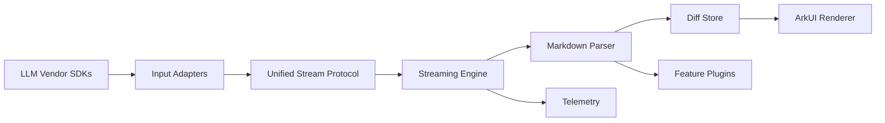

# @ycj3/streaming-markdown Architecture

## 1. Vision

`@ycj3/streaming-markdown` is the rendering layer between LLM vendor SDKs and HarmonyOS ArkUI applications.

Design goals:
- Real-time streaming rendering for token/delta input.
- Stable and vendor-agnostic integration API.
- Incremental parse and diff update for high performance.
- Extensible plugin architecture for Markdown features.

## 2. Layered Architecture



### 2.1 Input Adapters

Responsibilities:
- Convert vendor-specific events into unified stream events.
- Handle SSE/WebSocket protocol differences.
- Normalize completion and error events.

### 2.2 Unified Stream Protocol

Contract:
- `append(chunk: string)`
- `finish()`
- `error(err)`

This protocol is the only contract consumed by the rendering engine.

### 2.3 Streaming Engine

Responsibilities:
- Queue management (`inputQueue`, `renderQueue`).
- Scheduling by mode (`char`, `word`, `chunk`).
- Lifecycle (`idle`, `streaming`, `paused`, `completed`).
- Backpressure and tick pacing.

### 2.4 Markdown Parser

Responsibilities:
- Incremental parse via reducer state machine.
- Emit immutable `BlockDiff` updates.
- Maintain parser context for mixed syntax and partial tokens.

### 2.5 Diff Store

Responsibilities:
- Keep current `Block[]` state.
- Apply `append`/`patch` diffs.
- Provide stable block identity and UI-refresh keys.

### 2.6 ArkUI Renderer

Responsibilities:
- Consume parsed block state.
- Render block types (`heading`, `paragraph`, `code`, `table`, etc.).
- Keep view updates limited to changed blocks.

### 2.7 Feature Plugins

Responsibilities:
- Extend markdown capabilities without touching core stream engine.
- Examples: math renderer, syntax highlighter, link safety policy.

### 2.8 Telemetry

Responsibilities:
- Performance metrics: first render latency, frame drops, throughput.
- Reliability metrics: parse errors, adapter errors, stream completion rate.
- Debug logging control with production-safe defaults.

## 3. Suggested Project Structure

```txt
src/main/ets/
  index.ets
  core/
    stream/
      stream.ts
      scheduler.ts
      queue.ts
      state.ts
    parser/
      reducer.ts
      registry.ts
      types.ts
      protocol.ts
      reducers/*
    vendor/
      adapters/
        sse-adapter.ts
        ws-adapter.ts
      profiles/
        openai.ts
        anthropic.ts
        qwen.ts
        kimi.ts
    plugins/
      math/*
      code-highlight/*
      link-policy/*
    observability/
      metrics.ts
      logger.ts
  ui/
    StreamingMarkdown.ets
    BlockView.ets
    blocks/*
docs/
  architecture.md
  vendor-integration.md
  benchmark.md
examples/
  harmony-demo/
```

## 4. Data Flow

1. Vendor SDK produces stream events (delta/token).
2. Adapter normalizes events to unified protocol.
3. Stream engine enqueues chunks and schedules rendering ticks.
4. Parser consumes incremental chars and emits `BlockDiff`.
5. Diff store applies updates to block state.
6. UI re-renders only changed blocks.
7. On finish, parser `close()` flushes incomplete state and final patch is emitted.

## 5. API Direction (V2)

### 5.1 Stream API

```ts
interface StreamOptions {
  mode?: 'char' | 'word' | 'chunk'
  interval?: number
}

class MarkdownStream {
  append(chunk: string): void
  finish(): void
  pause(): void
  resume(): void
  reset(): void
  subscribe(listener: (diff: BlockDiff) => void): () => void
  onComplete(listener: () => void): () => void
}
```

### 5.2 UI API

```ts
interface StreamingMarkdownProps {
  stream: MarkdownStream
  onComplete?: () => void
}
```

## 6. Non-Functional Targets

- Low latency: visible update under one tick after chunk append.
- Stability: deterministic parser behavior for partial/incomplete markdown.
- Scalability: support long outputs with bounded update overhead.
- Extensibility: new markdown features shipped as reducer/plugin additions.

## 7. Milestones

- M1: Stream-only API and component migration (`stream` prop only).
- M2: Remove hot-path debug logs, add debug gating, baseline benchmarks.
- M3: Parser snapshot tests + stream lifecycle tests.
- M4: Vendor adapter profiles and integration examples.
